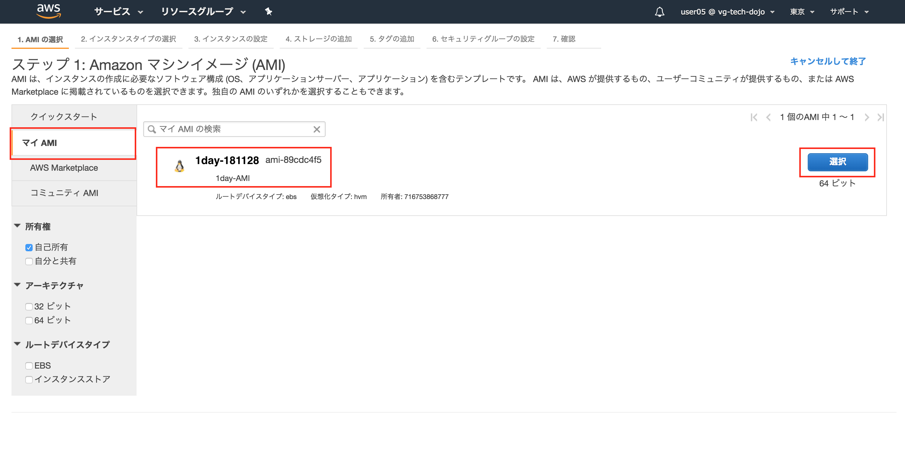
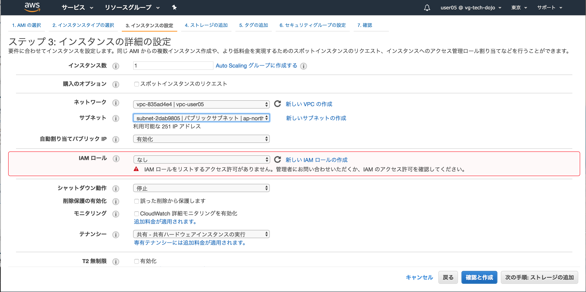

# Step-1
Step-1ではVPCを作成し、WordpressがインストールされたAMIを用いてEC2インスタンスを起動します。

## Question VPCとは
VPCについて調べてみましょう(10分)

## VPCの作成
**実際にVPCを作成してみましょう。まずはサービスタブを選択しVPC管理ページを開きましょう**


----

**下にスクロールしVPCを選択します**


----

**VPCウィザードの開始を選択します**


----

**「ステップ1:VPC設定の選択」では「1個のパブリックサブネットを持つVPC」タブから選択ボタンを押下**


----

**「ステップ2:1個のパブリックサブネットを持つVPC」では以下を入力しVPCの作成ボタンを押下**

**VPC名: vpc-ユーザ名(例 vpc-user05 )**  
**アベイラビリティゾーン: ap-northeast-1d**  


----

**「VPCが正常に作成されました」ではOKボタンを押下**


----

**「VPCダッシュボード」では直下の「VPCでフィルタリング」でユーザ名を入力しフィルタリングしましょう。以下の例ではuser05でフィルタリングしています**


----

**作成したVPCの設定が正しいかVPCタブをクリックし内容を確認しましょう**

**名前: vpc-ユーザ名**  
**IPv4 CIDR: 10.0.0.0/16**  


----

**ウィザードで作成したサブネットを確認しましょう。VPC作成ウィザードでは、VPC自体と一緒に1つ目のサブネットも作成されます。**


----

**作成したサブネットのRoute Tableを確認しましょう。VPCのネットワークアドレス 10.0.0.0/16 のターゲットがlocalに、デフォルトルートの 0.0.0.0/0 のターゲットがインタネットゲートウェイ(igw-XXXX)になっており、インターネットと通信できる設定になっています。**
 


----

## サブネットの追加作成

**作成したVPCに対して追加でサブネットを加えましょう。ここではサブネットの3つ作成を行いましょう**


----
**1から4を以下を参考に設定しましょう。**

|-|1 名前タグ|2 VPC|3 アベイラビリティ ゾーン|4 CIDR ブロック|
|:-|:-|:-|:-|:-|
|2つ目|パブリックサブネット|自分で作成したVPCを指定|ap-northeast-1c|10.0.1.0/24|
|3つ目|プライベートサブネット|自分で作成したVPCを指定|ap-northeast-1d|10.0.2.0/24|
|4つ目|プライベートサブネット|自分で作成したVPCを指定|ap-northeast-1c|10.0.3.0/24|


----
**全てのサブネットを確認しましょう。4つ作成され赤枠の内容が設定通りか確認しましょう。その際にIPv4でソートすると見易いです。**


----
**パブリックサブネット(10.0.1.0/24)のルートテーブルを変更しましょう。パブリックサブネット(10.0.1.0/24)を選択しルートテーブルタブを選択、編集ボタンを押下**


----
**現在使用しているルートテーブル以外にもう一つ選択できるはずです。そちらを選択し保存ボタンにて保存しましょう。選択するとインターネットゲートウェイの設定が追加されます。**


----

## EC2インスタンスの作成
**サービスタブからEC2を選択**


----
**Webサーバの作成を行いましょう。インスタンスの作成ボタンを押下**


----
**マイAIMタブ、「1Day-AMI」の選択ボタンを押下**



----


----



----


----


----


----


----


----


----


----


----
**作成したEC2インスタンスにて赤枠で囲った「パブリックDNS(IPv4)」の値をコピーしましょう。サーバログインのドメイン、WordpressのURLとなります。**


----

## Question AMIとは
AMIについて調べてみましょう(10分)

## サーバログイン
**作成したEC2インスタンスにログインし環境の確認をしましょう。`1day-userXX.pem`は各自が作成した秘密鍵、ec2-XXXXXX.comは「パブリックDNS(IPv4)」の値です。「ec2-user@ip-10-0-0-XX」のプロンプトが返れば成功です**

```
$ chmod 600 1day-userXX.pem
$ ssh -i 1day-userXX.pem -o StrictHostKeyChecking=no ec2-user@ec2-XXXXXX.com
[ec2-user@ip-10-0-0-65 ~]$
```

**MySQLにrootユーザで接続し、所有しているデータベースの確認をしてみましょう**

**パスワードは`wordpress`**

```
$ mysql -u root -p
Enter password:

mysql> show databases;
+--------------------+
| Database           |
+--------------------+
| information_schema |
| mysql              |
| performance_schema |
| test               |
| wordpress          |
+--------------------+
5 rows in set (0.00 sec)
```

## Question
1.このサーバに振られたIPアドレスの確認をしましょう。  
2.このサーバのデフォルトゲートウェイを確認しましょう。

## Wordpressの初期設定
**「パブリックDNS(IPv4)」の値でブラウザを開きましょう。Wordpressのサイトが開けば作成成功です。初期設定では「日本語」を選択し続けるボタンを押下**


----
**「さあ、始めましょう」を押下**


----


----


----


----


----
**ここまでの設定が間違いないか、ユーザ、パスワードを設定しログインしましょう**


----
**管理画面にログインできれば設定完了です**


----
**「パブリックDNS(IPv4)」の値でブラウザを開きましょう。Wordpressのサイトが開けば設定完了です**


----

**ここまでのオペレーションでStep1は完了です！**
