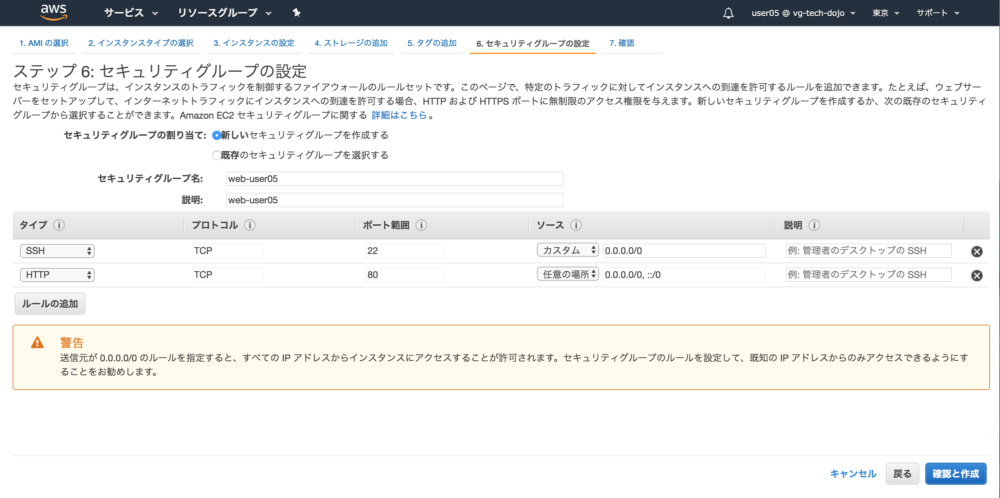
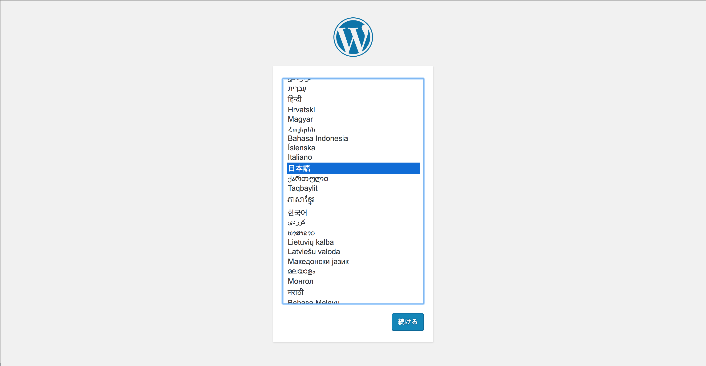

# Step-1
Step-1ではVPCを作成し、WordpressがインストールされたAMIを用いてEC2インスタンスを起動します。

## Question VPCとは
VPCについて調べてみましょう(10分)

## VPCの作成
**実際にVPCを作成してみましょう。まずはサービスタブを選択しVPC管理ページを開きましょう**

----

**VPCを選択します**

----

**VPCウィザードの開始を選択します**

----

**「ステップ1:VPC設定の選択」では「1個のパブリックサブネットを持つVPC」タブから選択ボタンを押下**

----

**「ステップ2:1個のパブリックサブネットを持つVPC」では以下を入力しVPCの作成ボタンを押下**

**VPC名: vpc-ユーザ名(例 vpc-user05 )**  
**アベイラビリティゾーン: ap-northeast-1d**  

----

**「VPCが正常に作成されました」ではOKボタンを押下**

----

**「VPCダッシュボード」では直下の「VPCでフィルタリング」でユーザ名を入力しフィルタリングしましょう。以下の例ではuser05でフィルタリングしています**

----

**作成したVPCの設定が正しいかVPCタブをクリックし内容を確認しましょう**

**名前: vpc-ユーザ名**  
**IPv4 CIDR: 10.0.0.0/16**  

----

**ウィザードで作成したサブネットを確認しましょう。VPC作成ウィザードでは、VPC自体と一緒に1つ目のサブネットも作成されます。**

----

**作成したサブネットのRoute Tableを確認しましょう。VPCのネットワークアドレス 10.0.0.0/16 のターゲットがlocalに、デフォルトルートの 0.0.0.0/0 のターゲットがインタネットゲートウェイ(igw-XXXX)になっており、インターネットと通信できる設定になっています。**
 

----

## サブネットの追加作成

**作成したVPCに対して追加でサブネットを加えましょう。ここではサブネットの3つ作成を行いましょう**

----
**1から4を以下を参考に設定しましょう。**

|-|1 名前タグ|2 VPC|3 アベイラビリティ ゾーン|4 CIDR ブロック|
|:-|:-|:-|:-|:-|
|2つ目|パブリックサブネット|自分で作成したVPCを指定|ap-northeast-1c|10.0.1.0/24|
|3つ目|プライベートサブネット|自分で作成したVPCを指定|ap-northeast-1d|10.0.2.0/24|
|4つ目|プライベートサブネット|自分で作成したVPCを指定|ap-northeast-1c|10.0.3.0/24|

----
**全てのサブネットを確認しましょう。4つ作成され赤枠の内容が設定通りか確認しましょう。その際にIPv4でソートすると見易いです。**

----
**パブリックサブネット(10.0.1.0/24)のルートテーブルを変更しましょう。パブリックサブネット(10.0.1.0/24)を選択しルートテーブルタブを選択、編集ボタンを押下**

----
**現在使用しているルートテーブル以外にもう一つ選択できるはずです。そちらを選択し保存ボタンにて保存しましょう。選択するとインターネットゲートウェイの設定が追加されます。**

----

## EC2インスタンスの作成

----

----

----

----

----

----

----

----

----

----

----

----

## Wordpressの初期設定

----
