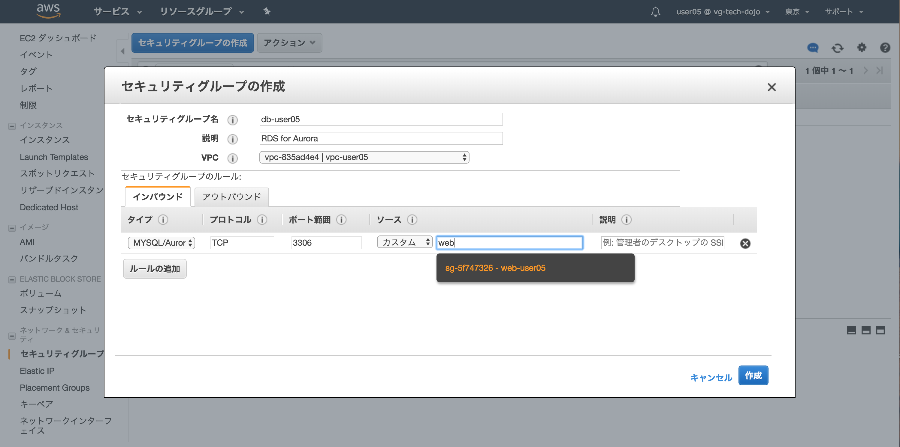
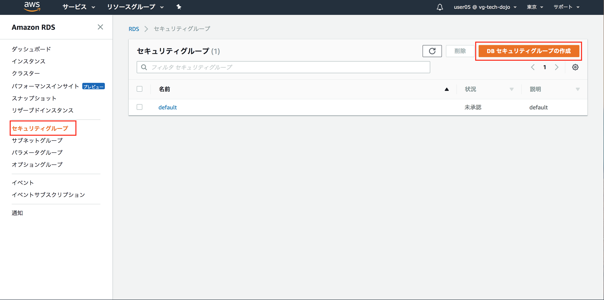
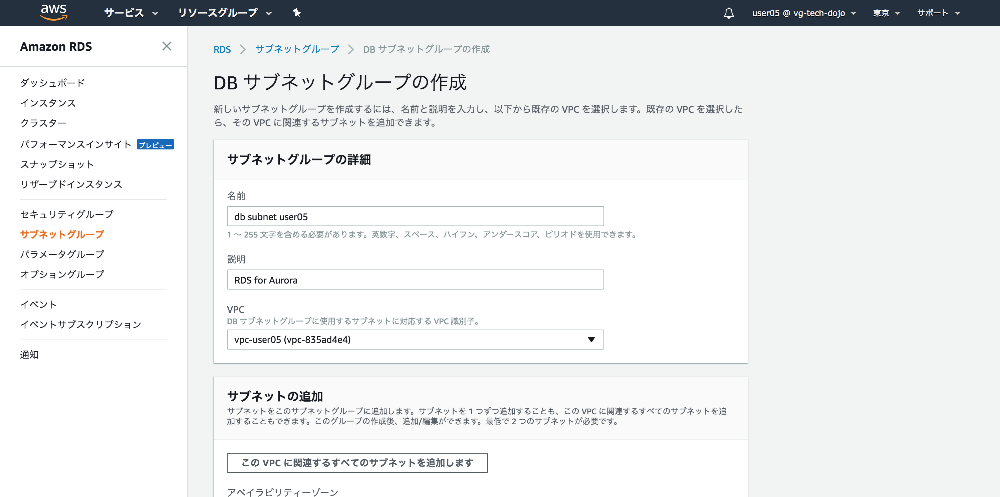
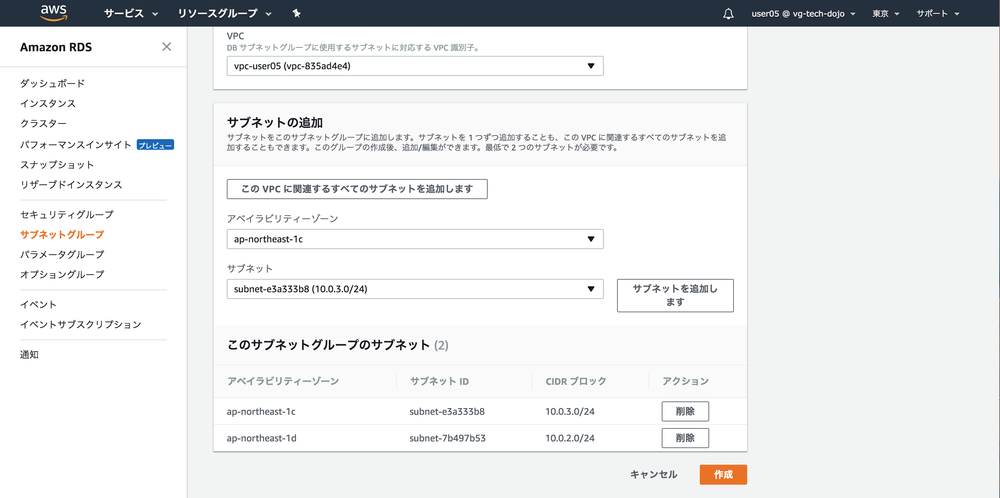

# Step-2
Step-2ではミドルウェアレベルでの垂直分散を行います。具体的には「パブリックサブネット」内のEC2単体で賄っていたミドルウェアのうちMySQLを「プライベートサブネット」に「Amazon Aurora MySQL」を利用して切り出します。

## Question 垂直分散とは
垂直分散について調べてみましょう(10分)

## Question RDS、Auroraとは
RDS(Relational Database Service)、Auroraについて調べてみましょう(10分)

## DB用セキュリティグループの作成
**サービスからEC2を選択しましょう**

----
**セキュリティグループタグからセキュリティグループの作成ボタンを押下**

----

|項目|設定値|
|:-|:-|
|セキュリティグループ名|db-ユーザ名 (例 db-user05)|
|説明|RDS for Aurora|
|VPC|作成したVPCを指定|

----

----

----

## DBサブネットグループの作成

----

----

----

----
