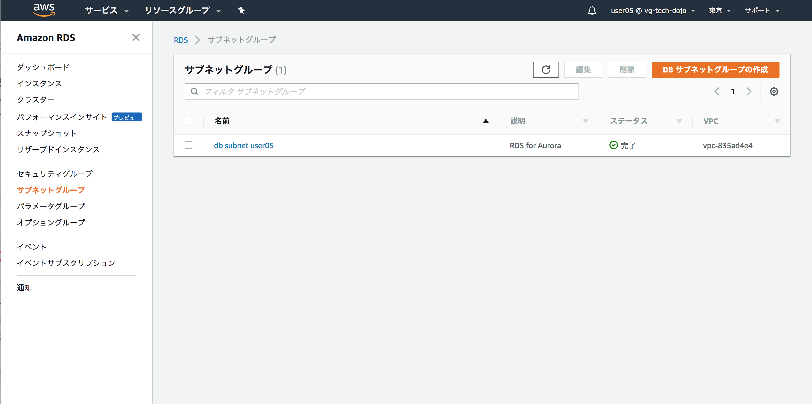
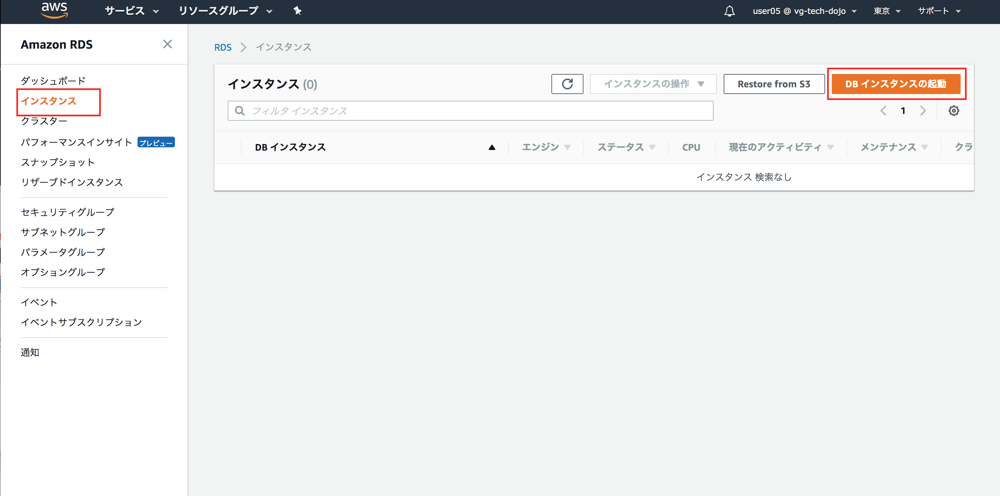
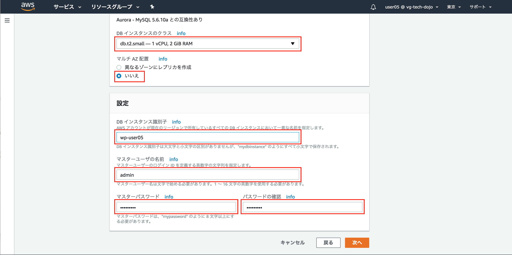
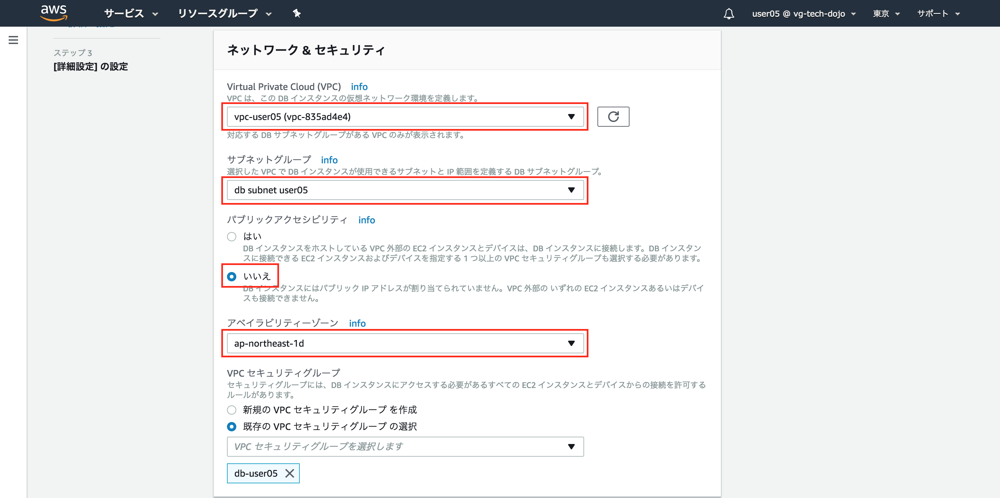
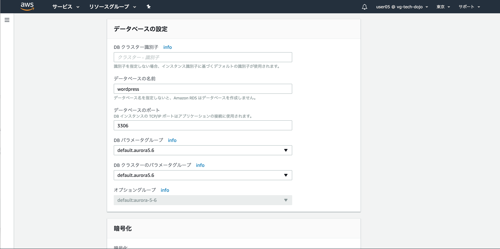
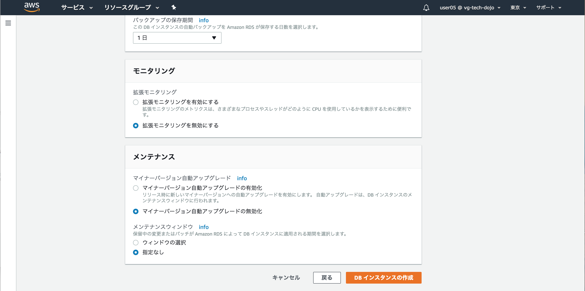
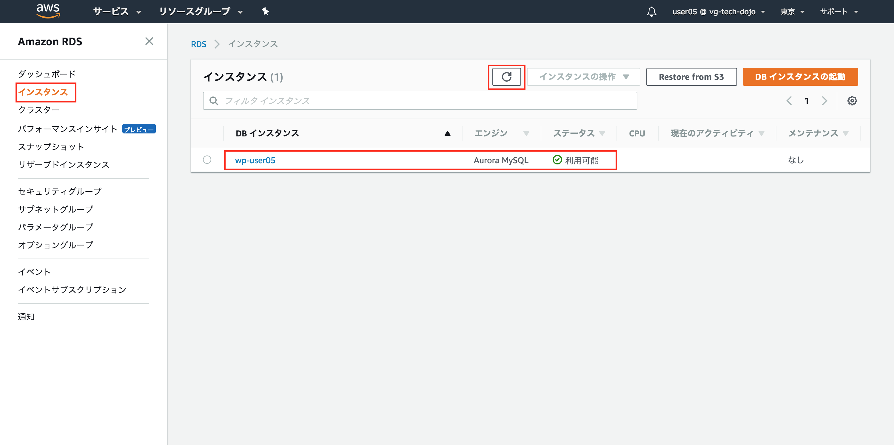
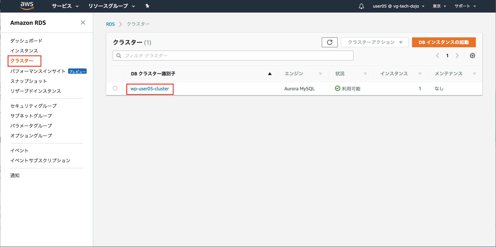
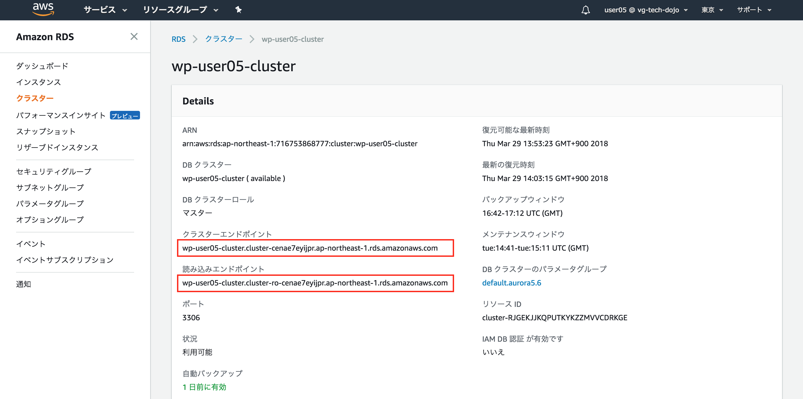

# Step-2
Step-2ではミドルウェアレベルでの垂直分散を行います。具体的には「パブリックサブネット」内のEC2単体で賄っていたミドルウェアのうちMySQLを「プライベートサブネット」に「Amazon Aurora MySQL」を利用して切り出します。

## Question 垂直分散とは
垂直分散について調べてみましょう(10分)

## Question RDS、Auroraとは
RDS(Relational Database Service)、Auroraについて調べてみましょう(10分)

## DB用セキュリティグループの作成
**サービスからEC2を選択しましょう**


----
**セキュリティグループタグからセキュリティグループの作成ボタンを押下**


----

|項目|設定値|
|:-|:-|
|セキュリティグループ名|db-ユーザ名 (例 db-user05)|
|説明|RDS for Aurora|
|VPC|作成したVPCを指定|


----


----


----

## DBサブネットグループの作成


----


----


----


----



----

## RDS Auroraインスタンスの作成
**インスタンスタブからインスタンスの起動ボタンを押下**



----
**Amazon Auroraを選択し次へボタンを押下**


----



----



----



----



----


----



----



----



----

## 接続確認
**EC2サーバにSSH接続し、EC2サーバからAuroraに接続してみましょう。また作成したAuroraインスタンスが意図したセグメントに配置されているかも確認しましょう。**

```
$ ssh -i 1day-userXX.pem -o StrictHostKeyChecking=no ec2-user@ec2-XXXXXX.com
[ec2-user@ip-10-0-0-65 ~]$
```

**クラスタエンドポイントを使用してAuroraに接続しましょう。読み書きの権限についても確認しましょう。**

**注意 wp-userXX-cluster.cluster-cenae7eyijpr.ap-northeast-1.rds.amazonaws.comは各自のクラスタエンドポイントに直すこと。パスワードはAurora作成時に設定した内容を指定すること**

```
$ mysql -u admin -p -hwp-user05-cluster.cluster-cenae7eyijpr.ap-northeast-1.rds.amazonaws.com

mysql> select @read_only;
+------------+
| @read_only |
+------------+
| NULL       |
+------------+
1 row in set (0.00 sec)

mysql> exit
```

**続いてネットワークセグメントの確認(クラスタエンドポイント)をしましょう**

```
$ nslookup wp-user05-cluster.cluster-cenae7eyijpr.ap-northeast-1.rds.amazonaws.com
Server:     10.0.0.2
Address:    10.0.0.2#53

Non-authoritative answer:
wp-user05-cluster.cluster-cenae7eyijpr.ap-northeast-1.rds.amazonaws.com canonical name = wp-user05.cenae7eyijpr.ap-northeast-1.rds.amazonaws.com.
Name:   wp-user05.cenae7eyijpr.ap-northeast-1.rds.amazonaws.com
Address: 10.0.2.226
```

**読み込みエンドポイントを使用してAuroraに接続しましょう。読み書きの権限についても確認しましょう。**

**注意 wp-userXX-cluster.cluster-ro-cenae7eyijpr.ap-northeast-1.rds.amazonaws.comは各自の読み込みエンドポイントに直すこと。パスワードはAurora作成時に設定した内容を指定すること**

```
$ mysql -u admin -p -hwp-userXX-cluster.cluster-ro-cenae7eyijpr.ap-northeast-1.rds.amazonaws.com

mysql> select @read_only;
+------------+
| @read_only |
+------------+
| NULL       |
+------------+
1 row in set (0.01 sec)

mysql> exit
```

**続いてネットワークセグメントの確認(読み込みエンドポイント)をしましょう**

```

$ nslookup wp-user05-cluster.cluster-ro-cenae7eyijpr.ap-northeast-1.rds.amazonaws.com
Server:     10.0.0.2
Address:    10.0.0.2#53

Non-authoritative answer:
wp-user05-cluster.cluster-ro-cenae7eyijpr.ap-northeast-1.rds.amazonaws.com  canonical name = wp-user05.cenae7eyijpr.ap-northeast-1.rds.amazonaws.com.
Name:   wp-user05.cenae7eyijpr.ap-northeast-1.rds.amazonaws.com
Address: 10.0.2.226
```

## データ移行
**原始的なバックアップリストアの機能を用いてEC2インスタンスのMySQL内にあるWordpressのデータをAuroraに移行します**

**EC2インスタンスにログイン(事前にログインしてる場合は割愛する)**

```
$ ssh -i 1day-userXX.pem -o StrictHostKeyChecking=no ec2-user@ec2-XXXXXX.com
[ec2-user@ip-10-0-0-65 ~]$
```

**mysqldumpを使いEC2インスタンスMySQLからデータバックアップ。パスワードは設定した内容を指定(wordpress)**

```
$ mysqldump -u root -p wordpress > export.sql
Enter password:
[ec2-user@ip-10-0-0-65 ~]$ ll
合計 220
-rw-rw-r-- 1 ec2-user ec2-user 221255  3月 30 00:55 export.sql
```

**EC2インスタンスのMySQLは今後使用しないので停止し、自動起動の設定を抑止しましょう**

```
$ sudo service mysqld stop
$ sudo chkconfig --list mysqld
mysqld          0:off   1:off   2:off   3:on    4:on    5:on    6:off

$ sudo chkconfig --level 345 mysqld off
$ sudo chkconfig --list mysqld
mysqld          0:off   1:off   2:off   3:off   4:off   5:off   6:off
```

**リストア**

**Auroraのクラスタエンドポイントを指定してexport.sqlをリストアしましょう**

```
mysql -u admin -p -hwp-userXX-cluster.cluster-cenae7eyijpr.ap-northeast-1.rds.amazonaws.com  wordpress < export.sql
Enter password:
```

## WordpressのDB接続変更

```
$ sudo vi /var/www/html/wp-config.php
- define('DB_HOST', 'localhost');
+ define('DB_HOST', 'wp-userXX-cluster.cluster-cenae7eyijpr.ap-northeast-1.rds.amazonaws.com');
```

**ブラウザでWordpressサイトである、EC2インスタンスのパブリック DNS (IPv4)を開きましょう。データリストア前と同様にWordpressが表示されれば成功です。**
