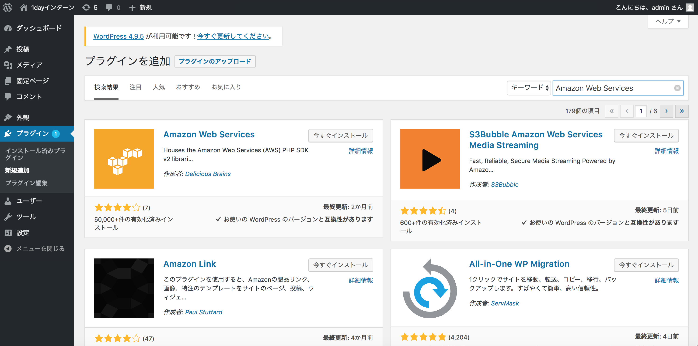
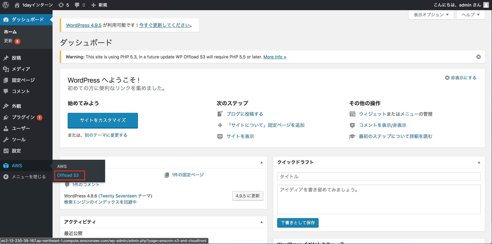
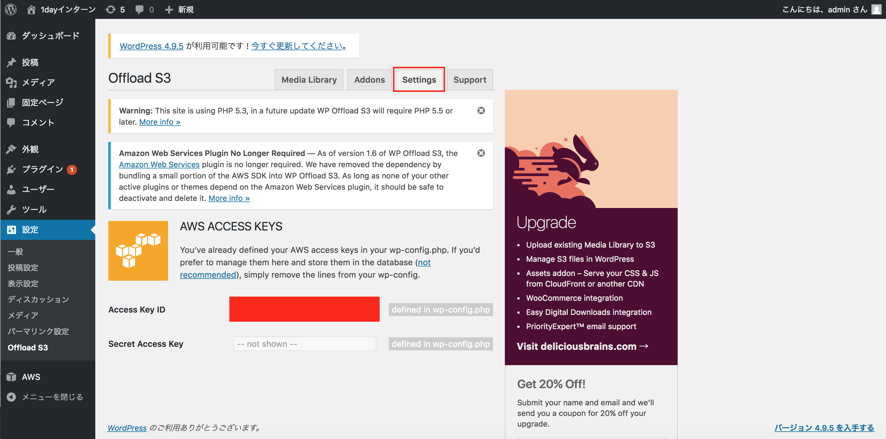

# Step-2
Step-2ではミドルウェアレベルでの垂直分散を行います。具体的には「パブリックサブネット」内のEC2単体で賄っていたミドルウェアのうちMySQLを「プライベートサブネット」に「Amazon Aurora MySQL」を利用して切り出します。

## 概要図


----

## Question 垂直分散とは
垂直分散について調べてみましょう(10分)

## Question RDS、Auroraとは
RDS(Relational Database Service)、Auroraについて調べてみましょう(10分)

## Question S3とは
S3について調べてみましょう(5分)

## DB用セキュリティグループの作成
**ここではStep-1で作成したEC2インスタンス内にあるMySQLを垂直分散させるために、10.0.2.0のプライベートサブネットに作るAurora用のセキュリティグループを作成します。サービスからEC2を選択しましょう**


----
**セキュリティグループタグからセキュリティグループの作成ボタンを押下**


----
**以下の設定値を設定しましょう。ルールの追加を押下**

|項目|設定値|
|:-|:-|
|セキュリティグループ名|db-ユーザ名 (例 db-user05)|
|説明|RDS for Aurora|
|VPC|作成したVPCを指定|


----
**MySQL/Auroraを選択し、ソースのカラムでは web などのキーワードで補完させ自分が作成したwebサーバ用のセキュリティグループを選択しましょう。選択ご作成ボタンを押下**


----
**作成したセキュリティグループ(db-userXX)が作成されていることを確認しましょう**


----

## DBサブネットグループの作成
**次にDB用のサブネットグループを作成します。サービスからRDSのリンクをクリック**


----
**左下のサブネットグループのリンクをクリックし、DBサブネットグループの作成ボタンを押下**


----
**サブネットグループの詳細を設定しましょう。名前は「db subnet userXX」XXは自身のユーザID、説明は「RDS for Aurora」、VPCは自身が作ったVPC(vpc-userXX)を指定しましょう**


----
**引き続き下にスクロールしサブネットの追加を行いましょう。以降のオペレーションをアベイラビリティゾーン1d,1cで行います。アベイラビリティゾーンから1dを選択、プライベートネットワークの10.0.2.0を選択、サブネットを追加しますボタンを押下、下段に追加されていることを確認、アベイラビリティゾーンから1cを選択、プライベートネットワークの10.0.3.0を選択、サブネットを追加しますボタンを押下、下段に追加されていることを確認、最後に作成ボタンを押下**


----
**作成されていることを確認しましょう**


----

## RDS Auroraインスタンスの作成
**これまでの準備を踏まえ、10.0.2.0のプライベートネットワークにRDS Auroraインスタンスを作成しましょう。インスタンスタブからインスタンスの起動ボタンを押下**


----
**Amazon Auroraを選択し次へボタンを押下**


----
**マスターパスワードは「wordpress」を指定、DBインスタンスは一番上のdb.t2.smallを選択、その他は以下を確認しましょう。全て設定したら次へボタンを押下**

|項目|設定値|
|:-|:-|
|DBインスタンスのクラス|db.t2.small|
|マルチAZ配置|いいえ|
|DBインスタンス識別子|wp-userXX XXは自身のID|
|マスターユーザの名前|admin|
|マスターパスワード|wordpress|


----
**ネットワークセキュリティでは以下の設定をしましょう**

|項目|設定値|
|:-|:-|
|Virtual Private Cloud (VPC)|自分が作成したVPCを選択|
|サブネットグループ|自分が作成したサブネットグループ「db subnet userXX」|
|パブリックアクセシビリティ|いいえを選択|
|アベイラビリティゾーン|ap-noatheast-1d|
|VPCセキュリティグループ|既存のVPCセキュリティグループの選択|
|VPCセキュリティグループを選択|作成したDB用のセキュリティグループを指定、合わせてdefaultは削除|


----
**データベースの設定は以下の設定をしましょう**

|項目|設定値|
|:-|:-|
|DBクラスター識別子|設定しない|
|データベースの名前|wordpress|
|データベースのポート|3306|
|DBパラメータグループ|そのまま|
|DBクラスターのパラメータグループ|そのまま|


----
**一番下までスクロールし、拡張モニタリングを無効に設定、メンテナンス：マイナーバージョン自動アップグレードの無効化に設定、最後にDBインスタンスの作成ボタンを押下**


----
**DBインスタンスの詳細の表示ボタンを押下**


----
**左のインスタンスのリンクをクリックし、右側に作成したAuroraインスタンスが表示されることを確認しましょう。ステータスが利用可能になるまでに数分掛かります**


----
**左のクラスターりのリンクをクリックし自分のユーザ名のあるクラスター識別子のリンクをクリックしましょう**


----
**クラスターエンドポイント、読み込みエンドポイントをメモしましょう。このエンドポイントがAuroraにアクセスする際に利用します**


----

## 接続確認
**EC2サーバにSSH接続し、EC2サーバからAuroraに接続してみましょう。また作成したAuroraインスタンスが意図したセグメントに配置されているかも確認しましょう。**

```
$ ssh -i 1day-userXX.pem -o StrictHostKeyChecking=no ec2-user@ec2-XXXXXX.com
[ec2-user@ip-10-0-0-65 ~]$
```

**クラスタエンドポイントを使用してAuroraに接続しましょう。読み書きの権限についても確認しましょう。**

**注意 wp-userXX-cluster.cluster-cenae7eyijpr.ap-northeast-1.rds.amazonaws.comは各自のクラスタエンドポイントに直すこと。パスワードはAurora作成時に設定した内容を指定すること**

```
$ mysql -u admin -p -hwp-user05-cluster.cluster-cenae7eyijpr.ap-northeast-1.rds.amazonaws.com

mysql> select @read_only;
+------------+
| @read_only |
+------------+
| NULL       |
+------------+
1 row in set (0.00 sec)

mysql> exit
```

**続いてネットワークセグメントの確認(クラスタエンドポイント)をしましょう**

```
$ nslookup wp-user05-cluster.cluster-cenae7eyijpr.ap-northeast-1.rds.amazonaws.com
Server:     10.0.0.2
Address:    10.0.0.2#53

Non-authoritative answer:
wp-user05-cluster.cluster-cenae7eyijpr.ap-northeast-1.rds.amazonaws.com canonical name = wp-user05.cenae7eyijpr.ap-northeast-1.rds.amazonaws.com.
Name:   wp-user05.cenae7eyijpr.ap-northeast-1.rds.amazonaws.com
Address: 10.0.2.226
```

**読み込みエンドポイントを使用してAuroraに接続しましょう。読み書きの権限についても確認しましょう。**

**注意 wp-userXX-cluster.cluster-ro-cenae7eyijpr.ap-northeast-1.rds.amazonaws.comは各自の読み込みエンドポイントに直すこと。パスワードはAurora作成時に設定した内容を指定すること**

```
$ mysql -u admin -p -hwp-userXX-cluster.cluster-ro-cenae7eyijpr.ap-northeast-1.rds.amazonaws.com

mysql> select @read_only;
+------------+
| @read_only |
+------------+
| NULL       |
+------------+
1 row in set (0.01 sec)

mysql> exit
```

**続いてネットワークセグメントの確認(読み込みエンドポイント)をしましょう**

```

$ nslookup wp-user05-cluster.cluster-ro-cenae7eyijpr.ap-northeast-1.rds.amazonaws.com
Server:     10.0.0.2
Address:    10.0.0.2#53

Non-authoritative answer:
wp-user05-cluster.cluster-ro-cenae7eyijpr.ap-northeast-1.rds.amazonaws.com  canonical name = wp-user05.cenae7eyijpr.ap-northeast-1.rds.amazonaws.com.
Name:   wp-user05.cenae7eyijpr.ap-northeast-1.rds.amazonaws.com
Address: 10.0.2.226
```

## データ移行
**原始的なバックアップリストアの機能を用いてEC2インスタンスのMySQL内にあるWordpressのデータをAuroraに移行します**

**EC2インスタンスにログイン(事前にログインしてる場合は割愛する)**

```
$ ssh -i 1day-userXX.pem -o StrictHostKeyChecking=no ec2-user@ec2-XXXXXX.com
[ec2-user@ip-10-0-0-65 ~]$
```

**mysqldumpを使いEC2インスタンスMySQLからデータバックアップ。パスワードは設定した内容を指定(wordpress)**

```
$ mysqldump -u root -p wordpress > export.sql
Enter password:
[ec2-user@ip-10-0-0-65 ~]$ ll
合計 220
-rw-rw-r-- 1 ec2-user ec2-user 221255  3月 30 00:55 export.sql
```

**EC2インスタンスのMySQLは今後使用しないので停止し、自動起動の設定を抑止しましょう**

```
$ sudo service mysqld stop
$ sudo chkconfig --list mysqld
mysqld          0:off   1:off   2:off   3:on    4:on    5:on    6:off

$ sudo chkconfig --level 345 mysqld off
$ sudo chkconfig --list mysqld
mysqld          0:off   1:off   2:off   3:off   4:off   5:off   6:off
```

**リストア**

**Auroraのクラスタエンドポイントを指定してexport.sqlをリストアしましょう**

```
mysql -u admin -p -hwp-userXX-cluster.cluster-cenae7eyijpr.ap-northeast-1.rds.amazonaws.com  wordpress < export.sql
Enter password:
```

## WordpressのDB接続変更

```
$ sudo vi /var/www/html/wp-config.php
- define('DB_HOST', 'localhost');
+ define('DB_HOST', 'wp-userXX-cluster.cluster-cenae7eyijpr.ap-northeast-1.rds.amazonaws.com');
```

**ブラウザでWordpressサイトである、EC2インスタンスのパブリック DNS (IPv4)を開きましょう。データリストア前と同様にWordpressが表示されれば成功です。**

## WordPressにプラグインの導入
**S3を利用するためにWordPressにプラグインを導入しましょう。最初に「Amazon Web Services」で検索し、今すぐインストールボタンをクリックしましょう。**



----
**有効化をクリック**


----
**次に「WP Offload S3 Lite」を検索し今すぐインストールボタンをクリックしましょう**


----
**有効化をクリック**


----

**EC2インスタンスにログイン(事前にログインしてる場合は割愛する)**

```
$ ssh -i 1day-userXX.pem -o StrictHostKeyChecking=no ec2-user@ec2-XXXXXX.com
[ec2-user@ip-10-0-0-65 ~]$
```

**以下の2行(+は不要)を追記しましょう。アクセスキー、シークレットアクセスキーは事前に配布したものに書き換えましょう**
```
$ sudo vi /var/www/html/wp-config.php
+ define( 'DBI_AWS_ACCESS_KEY_ID', '********************' );
+ define( 'DBI_AWS_SECRET_ACCESS_KEY', '********************************' );
```
----
**Offload S3クリック**



----
**Settingタブをクリックしアクセスキーが設定されていることを確認する**



----
**S3の作成、サービスからS3を選択**


----
**バケットを作成するボタンを押下**


----
**ここまでのオペレーションでStep2は完了です！**
