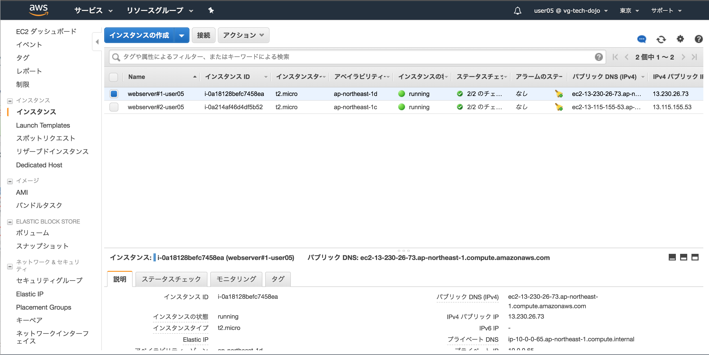
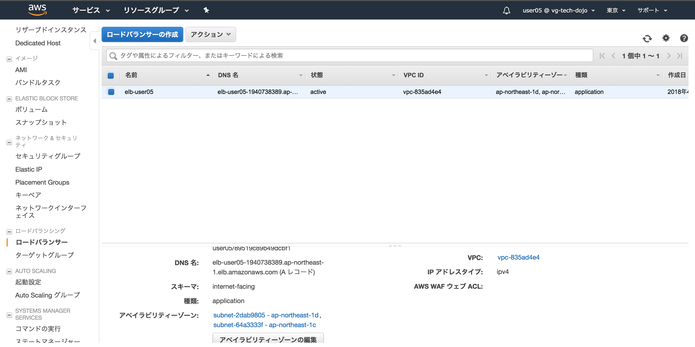
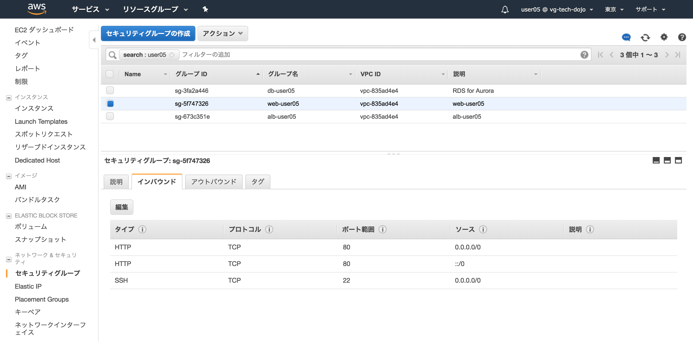
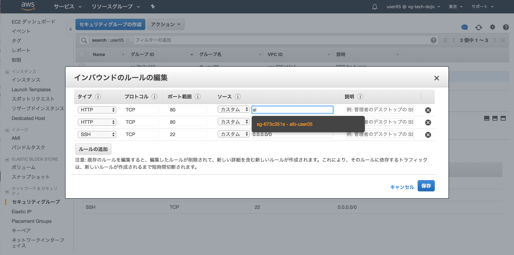
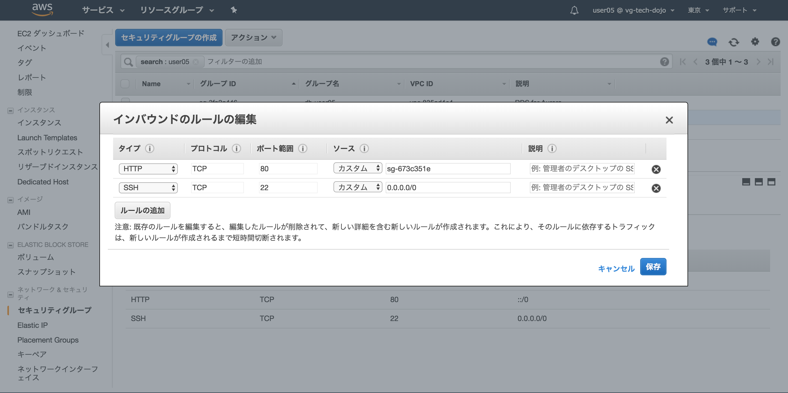

# Step-3
Step-3ではWebサーバとアプリケーションレイヤの水平分散、データベースレイヤの冗長化を行います。具体的にはStep-2の環境にロードバランサを配置しEC2インスタンスを2つのアベイラビリティゾーンに水平分散、プライベートサブネットに配置されたデータベースAuroraを同様に2つのアベイラビリティゾーンに配置(MultiA-Z構成)し冗長構成とします。

## 概要図


----

## Question 水平分散とは
水平分散について調べてみましょう(10分)

## Question MultiA-Zとは
AWS MultiA-Zについて調べてみましょう(10分)

## AuroraをMultiA-Z構成に変更
**ここではStep-2で作成したAuroraインスタンスをMultiA-Zの機能を用いて冗長化します。サービスからRDSを選択しましょう**


----
**左側のインスンタンスリンクをクリックし、作成したAuroraインスタンス(wp-userXX)をチェックし、インスタンスの操作のプルダウンからAuroraレプリカの作成を選択しましょう**


----
**アベイラビリティゾーンはap-northeast-1cを選択、インターネットゲートウェイからのアクセスは抑止するためパブリックアクセス可能では"いいえ”を選択**


----
**下にスクロールし、インスタンスの仕様は"db.t2.small"が選択されていること、設定でのDBインスタンス識別子では「wp-user05-slave」としましょう**


----
**更に下にスクロールし、設定内容は変更せず、Auroraレプリカの作成ボタンを押下**


----
**約5分ほどでAuroraのレプリカは作成されます。画面中央上のリロードボタンを押して「利用可能」になるまで待ちましょう**


----

## Auroraクラスターの確認
**追加で作成したAuroraインスタンス含めクラスターエンドポイント、読み取りエンドポイントが利用可能か確認しましょう。左のクラスターリンクをクリックしStep-2で作成したDBクラスター識別子のリンクをクリックしましょう**


----
**クラスターエンドポイント、読み込みエンドポイントの確認をしましょう**


----

## 接続確認
**EC2サーバにSSH接続し、EC2サーバからAuroraに接続してみましょう。また作成したAuroraインスタンスが意図したセグメントに配置されているかも確認しましょう。**

```
$ ssh -i 1day-userXX.pem -o StrictHostKeyChecking=no ec2-user@ec2-XXXXXX.com
[ec2-user@ip-10-0-0-65 ~]$
```

**クラスタエンドポイントを使用してAuroraに接続しましょう。**

**注意 wp-userXX-cluster.cluster-cenae7eyijpr.ap-northeast-1.rds.amazonaws.comは各自のクラスタエンドポイントに直すこと。パスワードはAurora作成時に設定した内容(この資料ではwordpressとなっています)を指定すること**

```
$ mysql -u admin -p -hwp-user05-cluster.cluster-cenae7eyijpr.ap-northeast-1.rds.amazonaws.com

mysql> select @read_only;
+------------+
| @read_only |
+------------+
| NULL       |
+------------+
1 row in set (0.00 sec)

mysql> exit
```

**続いてクラスタエンドポイントが存在するネットワークセグメントの確認をしましょう。10.0.2.XXXなら正しい設定です**

```
$ nslookup wp-user05-cluster.cluster-cenae7eyijpr.ap-northeast-1.rds.amazonaws.com
Server:     10.0.0.2
Address:    10.0.0.2#53

Non-authoritative answer:
wp-user05-cluster.cluster-cenae7eyijpr.ap-northeast-1.rds.amazonaws.com canonical name = wp-user05.cenae7eyijpr.ap-northeast-1.rds.amazonaws.com.
Name:   wp-user05.cenae7eyijpr.ap-northeast-1.rds.amazonaws.com
Address: 10.0.2.226
```

**読み込みエンドポイントを使用してAuroraに接続しましょう。**

**注意 wp-userXX-cluster.cluster-ro-cenae7eyijpr.ap-northeast-1.rds.amazonaws.comは各自の読み込みエンドポイントに直すこと。パスワードはAurora作成時に設定した内容を指定すること**

```
$ mysql -u admin -p -hwp-userXX-cluster.cluster-ro-cenae7eyijpr.ap-northeast-1.rds.amazonaws.com

mysql> select @read_only;
+------------+
| @read_only |
+------------+
| NULL       |
+------------+
1 row in set (0.01 sec)

mysql> exit
```

**続いて読み込みエンドポイントが存在するネットワークセグメントの確認をしましょう。10.0.3.XXXなら正しい設定です**

```
$ nslookup wp-user05-cluster.cluster-ro-cenae7eyijpr.ap-northeast-1.rds.amazonaws.com
Server:     10.0.0.2
Address:    10.0.0.2#53

Non-authoritative answer:
wp-user05-cluster.cluster-ro-cenae7eyijpr.ap-northeast-1.rds.amazonaws.com  canonical name = wp-user05-slave.cenae7eyijpr.ap-northeast-1.rds.amazonaws.com.
Name:   wp-user05-slave.cenae7eyijpr.ap-northeast-1.rds.amazonaws.com
Address: 10.0.3.217
```

## 系切り替え
**冗長構成となったAuroraのクラスターエンドポイントを切り替えてみましょう。左のインスタンスリンクをクリックし、Step-2で作成したAuroraインスタンスにチェック、インスタンスの操作プルダウンからフェイルオーバーを選択しましょう**


----
**フェイルオーバーボタンを押下**


----
**フェイルオーバー選択ごインスタンスが表示されている項目右端のレプリケーションロール「書き込み」「読み込み」が入れ代わればフェイルオーバー成功です。中央上のリロードを押し確認しましょう。数分掛かります**


----
**書き込み」「読み込み」が入れ代わればフェイルオーバー成功です**


----

## 接続確認
**EC2サーバにSSH接続し、EC2サーバからAuroraに接続してみましょう。フェイルオーバーにて作成したAuroraインスタンスが意図したセグメントに配置されているかも確認しましょう**

```
$ ssh -i 1day-userXX.pem -o StrictHostKeyChecking=no ec2-user@ec2-XXXXXX.com
[ec2-user@ip-10-0-0-65 ~]$
```

**クラスタエンドポイントが存在するネットワークセグメントの確認をしましょう。10.0.3.XXXなら正しい設定です**

```
$ nslookup wp-user05-cluster.cluster-cenae7eyijpr.ap-northeast-1.rds.amazonaws.com
Server:     10.0.0.2
Address:    10.0.0.2#53

Non-authoritative answer:
wp-user05-cluster.cluster-cenae7eyijpr.ap-northeast-1.rds.amazonaws.com canonical name = wp-user05-slave.cenae7eyijpr.ap-northeast-1.rds.amazonaws.com.
Name:   wp-user05-slave.cenae7eyijpr.ap-northeast-1.rds.amazonaws.com
Address: 10.0.3.217
```

**読み込みエンドポイントが存在するネットワークセグメントの確認をしましょう。10.0.2.XXXなら正しい設定です**

```
$ nslookup wp-user05-cluster.cluster-ro-cenae7eyijpr.ap-northeast-1.rds.amazonaws.com
Server:     10.0.0.2
Address:    10.0.0.2#53

Non-authoritative answer:
wp-user05-cluster.cluster-ro-cenae7eyijpr.ap-northeast-1.rds.amazonaws.com  canonical name = wp-user05.cenae7eyijpr.ap-northeast-1.rds.amazonaws.com.
Name:   wp-user05.cenae7eyijpr.ap-northeast-1.rds.amazonaws.com
Address: 10.0.2.226
```

## WebサーバのAMIを作成
**ここではWebサーバの水平分散にて必要となるEC2サーバのAMIを作成しましょう。AMIを作成することでここまでEC2サーバに設定した内容など全て反映された状態(Auroraの接続情報等)で水平分散が可能になります。**

**サービスからEC2を選択**


----
**左のインスタンスを選択し、Step-1で作成したEC2インスタンス「webserver#1-userXX」にチェック、アクションプルダウンからイメージとイメージの作成を選択しましょう**


----
**イメージ名、イメージの説明ともに「wordpress ユーザ名」で設定、設定後イメージの作成ボタンを押下**


----
**閉じるボタンを押下**


----
**左下AMIを選択しAMIが作成されれば完了です。数分で作成が完了します**


----

## 2台目のEC2インスタンスの作成(水平分散準備)
**インターネットゲートウェイ、ロードバランサーからHTTPリクエストを受け付けるWeb+AP(WordPress)サーバであるEC2インスタンスを先ほど作成したAMIも用いて作成しましょう**

**左下AMIリンクを選択、作成したAMIをチェック**


----
**アクションプルダウンから作成を選択**


----
**t2.microが選択されていることを確認し、次の手順：インスタンスの詳細の設定ボタンを押下**


----
**以下を設定しましょう**

|項目|設定値|
|:-|:-|
|ネットワーク|Step-1で作ったvpcを指定。vpc-userXX|
|サブネット|パブリックサブネット ap-northeast-1c 10.0.1.0を指定|
|自動割り当てパブリックIP|有効化|


----
**特に設定せず、次の手順：タグの追加を押下**


----
**タグの追加ボタンを押下**


----


----


----


----


----


----
**作成完了まで数分掛かります**


----
**パブリックDNS(IPv4)のあたいを確認しブラウザでWordpressが参照できるか確認しましょう**


----
**Wordpressが表示されれば成功です**


----

## EC2サーバの確認
**作成した2台目のEC2サーバにログイン(Wordpressを表示したパブリックDNSを使用)しIPアドレス、ゲートウェイ、ネームサーバなどを確認しましょう**

```
$ ssh -i 1day-userXX.pem -o StrictHostKeyChecking=no ec2-user@ec2-XXXXXXX.ap-northeast-1.compute.amazonaws.com

$ ip a
1: lo: <LOOPBACK,UP,LOWER_UP> mtu 65536 qdisc noqueue state UNKNOWN group default qlen 1
    link/loopback 00:00:00:00:00:00 brd 00:00:00:00:00:00
    inet 127.0.0.1/8 scope host lo
       valid_lft forever preferred_lft forever
    inet6 ::1/128 scope host
       valid_lft forever preferred_lft forever
2: eth0: <BROADCAST,MULTICAST,UP,LOWER_UP> mtu 9001 qdisc pfifo_fast state UP group default qlen 1000
    link/ether 0a:03:16:a3:6b:fa brd ff:ff:ff:ff:ff:ff
    inet 10.0.1.205/24 brd 10.0.1.255 scope global eth0
       valid_lft forever preferred_lft forever
    inet6 fe80::803:16ff:fea3:6bfa/64 scope link
       valid_lft forever preferred_lft forever

$ ip r
default via 10.0.1.1 dev eth0
10.0.1.0/24 dev eth0  proto kernel  scope link  src 10.0.1.205
169.254.169.254 dev eth0

$ cat /etc/resolv.conf
options timeout:2 attempts:5
; generated by /sbin/dhclient-script
search ap-northeast-1.compute.internal
nameserver 10.0.0.2
```

## ELB(ALB)の作成
**ここでは作成した2台のEC2インスタンスの前段にアクセスを振り分けるELB(ALB)の作成を行います**


----


----


----


----


----


----


----


----


----


----


----


----


----
**Wordpressが表示されれば成功です。ALBの設定から反映され、表示されるまで少し時間が掛かる可能性があります**


----

## Wordpressの設定変更
**EC2サーバに接続しましょう(2台のうちどちらでも可) 。接続後クラスタエンドポイントでAuroraに接続しoption_valueの更新を行いましょう**

```
$ mysql -u admin -p -hwp-userXX-cluster.cluster-cenae7eyijpr.ap-northeast-1.rds.amazonaws.com
Enter password:

mysql> use wordpress
mysql> select option_value from wp_options where option_name = 'siteurl' or option_name = 'home';
+--------------------------------------------------------------+
| option_value                                                 |
+--------------------------------------------------------------+
| http://ec2-13-230-XX-73.ap-northeast-1.compute.amazonaws.com |
| http://ec2-13-230-XX-73.ap-northeast-1.compute.amazonaws.com |
+--------------------------------------------------------------+
2 rows in set (0.00 sec)

mysql> update wp_options set option_value='http://elb-userXX-1940738389.ap-northeast-1.elb.amazonaws.com' where option_name = 'siteurl' or option_name = 'home';
Query OK, 2 rows affected (0.00 sec)
Rows matched: 2  Changed: 2  Warnings: 0

mysql> select option_value from wp_options where option_name = 'siteurl' or option_name = 'home';
+---------------------------------------------------------------+
| option_value                                                  |
+---------------------------------------------------------------+
| http://elb-userXX-1940738389.ap-northeast-1.elb.amazonaws.com |
| http://elb-userXX-1940738389.ap-northeast-1.elb.amazonaws.com |
+---------------------------------------------------------------+
2 rows in set (0.00 sec)

mysql>
```

## セキュリティグループの変更
**現在HTTPリクエストはELB、各EC2インスタンスが受け付けています。この設定をELBからのみアクセスを許可するよう、セキュリティグループの変更をしましょう**



----


----


----


----


----


----
**ELB(ALB)経由でアクセス出来れば設定成功です**


----
**2台のEC2に直接アクセスした場合はタイムアウトなどでエラーとなれば設定成功です**


----

## アクセス確認
**作成した2台のEC2環境にELB(ALB)からアクセスが振り分けられているかアクセスログから確認してみましょう**

```
$ sudo tail -f /var/log/nginx/access.log
```

